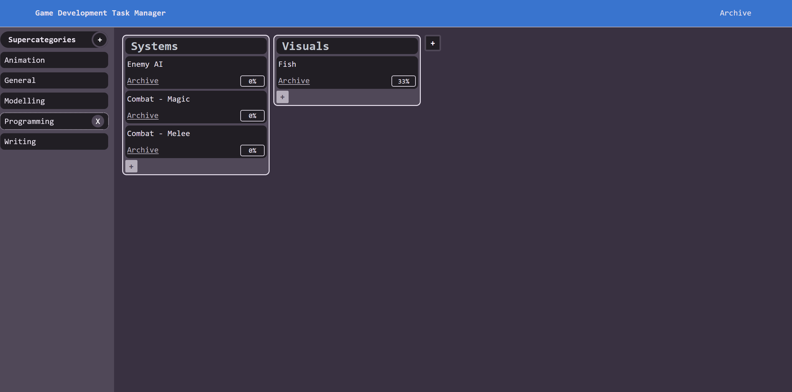

# **Game Development Manager Website**
This is my Level 2 NCEA project for Digital Technologies 

* Allows you organise your workflow into 4 different layers
* Versatile and flexible, useful for every part of game development organisation
* Customisable, reorder your supercategories, categories and tasks however you want
* Support for images in subtasks
* Easy to understand, featuring an intuitive design, optimised for the visually impaired.

(Designed for rendering in dark mode, some contrast may be affected when viewed on light mode)

## Documentation

The following documents support this project:

* [Design](docs/Design.md)
* [Development log](docs/Development.md)
