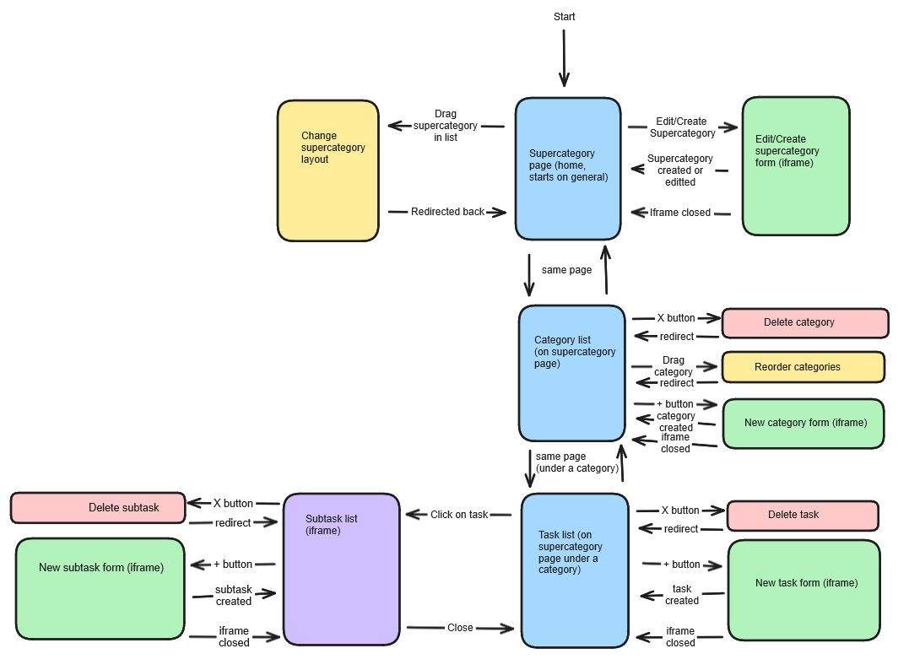
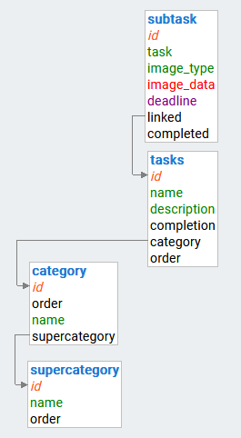
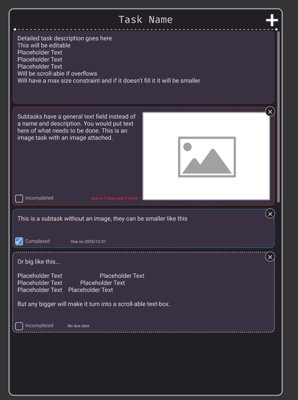

# Development of a Database-Linked Website for NCEA Level 2

Project Name: **Game Development Manager Website**

Project Author: **James Gerraty**

Assessment Standards: **91892** and **91893**

-------------------------------------------------

## Design, Development and Testing Log

### 16/05/24

Worked on a prototype for the database layout, where there are supercategories that store categories that store tasks that store subtasks.\
Both types of category hold a name and id.\
Tasks hold a name and description and a completion percentage
Subtasks hold a task name, optional image blob, and a deadline datetime.

### 21/05/24

Worked on a prototype for the site flowchart layout. I want the website to seem like it only has a single page, so we start on the general supercategory which displays all the categories and descendant tasks for that supercategory. Forms to create supercategories, categories, tasks, and subtasks will be done with iframes that display above the supercategory page. Delete and reorder requests will be handled by a page that redirects when done, or an invisible iframe that closes when done. This gives us a single page website.  
My current thinking is that supercategories will be displayed vertically on the left sidebar, categories will be displayed horizontally in the main portion of the page, and tasks will be displayed under the category. Clicking on a task will bring up an iframe which lists all the subtasks for a task.

### 30/05/24

I have made some changes to the database by adding the order keys to tasks as they need to be ordered within the task list for categories. Subtasks can be ordered by their id though I will ask my end users if they would really like to order subtasks as well. Also added a completed value to the table so that you can actually mark a subtask as done.

Have gotten my [wireframe](https://www.figma.com/proto/pfaXQRa3RBhN2Mvv3dRuT0/Game-Development-Manager---v0.0.1?node-id=1-2&t=Gp4fkgIBN0A21vR9-1&scaling=min-zoom&page-id=0%3A1&starting-point-node-id=1%3A2) into a state where I would like feedback on it before trying to get it too detailed, so I will show the prototype to my end users. I need to get some options for the colour theme that satisfies everyone's needs, especially for my end user with colour blindness.  
The subtask menu is still a work in progress.

**I had a conversation with two of my end users tonight after showing them the wireframe so far**  
### Feature suggestions:  
> Check list subtasks? - voxsinity  

> id maybe say one could have an embedded video but idk up to you - voxsinity

Videos are not something I want to add right now due to it being quite hard to store in a database  

> maybe you have an option to highlight more important things
> like words - voxsinity

I will try to support markdown or richtext for text fields  

> also do you need the ability to drag to reorder subtasks? - me  
> I do like the ability to reorder tasks  
> gives me more freedom  
> it would be very helpful - voxsinity  

> also do you want subtasks to be draggable to reorder them? - me  
> yessir - InconspicuousBotGuy

### Color palette suggestions:
> imo I'd do a uh  
> Blue of some sort - voxsinity (for the main accent color)  

> wait also what colors are hard to tell apart for you  
> i have to consider stuff like that - me    
> I'm mainly red green colorblind  
> but also i struggle with blue and purple  
> I can't see purple really except for some strict shades  
> idk what those shades are don't ask - voxsinity  

> so if i have just blue and some red there it shouldnt be confusing? - me  
> no  
> I'll be able to tell them apart  
> just as long as they aren't mangled together - voxsinity  

> i will probably replace the green with the blue for consistency - me  
> that would help - voxsinity  

> i find blue/orange accentuates these types of formats really well - InconspicuousBotGuy  

From this I have decided I will be using blue as a primary accent, replacing the green with said blue, and possibly using a more orange red and finding somewhere else to use orange as a secondary accent. I will also be updating the schema to include the order member to subtasks. I will not be adding videos. I will experiment with storing check list subtasks (maybe I can serialize it to store a variable number of checklist tasks within a subtask without further complicating the database)

### 10/06/24

I have decided on a [colour palette](https://www.realtimecolors.com/?colors=e9e2ef-393141-87bfe0-584d61-dc7856&fonts=Inter-Inter) using realtime colors. I will most likely be modifying the colours and taking alternative shades of the colours that fit better with my website.

I decided to scrap the orange accent for now as im not really sure where it fits, and I made the header a cornflower blue colour. The green was replaced by a light blue and I decided checkboxes should fill with the blue colour and have a white checkmark instead of have a green checkmark when enabled. This makes it easier to tell when a box is checked in my opinion.

I have bumped the version of my design to [v0.1.0](https://www.figma.com/design/HRjsMHtE3CrJ7whYkcAjqt/Game-Development-Manager---v0.1.0?node-id=0-1&t=mmCcCb4Uu9uTRTPN-1)  
see 12/06/24 for how to use the version history

### 12/06/24

When asking my team members about the colours:
> bring down font size of percentages just a hair so they can be easier to see? - InconspicuousBotGuy

I'm using the actual figma version history feature so if a previous version needs to be accessed, do so by opening the Game Development Manager file (not v0.0.1) and go to File/Show version history
I lowered the font size of the completion percentage on cards from 16 to 12 in v0.1.1, making it easier to read when its at '100%'

### 13/06/24

I have made some tweaks to the subtask page in v0.2.0  
The font for the content of the page has been changed from Fira Mono to Roboto, as I think its easier to read at this small size. The rest of the website still uses Fira Mono as I think it suits the website.  
The topbar of the subtask menu has been made more apparent with a dashed line and the scrollable container under it has been made apparent (also the content has been inset so that the scrollbar fits on the right)  
The delete buttons have been made less visible by removing the red background so that they don't draw as much attention and distract the user.  

In v0.2.1 I made the archive button under a card more apparent that is clickable without making it draw much more attention by underlining the text. This should hopefully communicate it is an action you can do to archive a card instead of "this card has been archived" which is not what it is showing.  
I also made some changes to the due date text in the subtask menu that should make it more visible. The font size has been increased by 2 and it uses the Condensed/Italic variant of Roboto so that it doesn't take up too much space. Completed cards will also strike-through the due date.  
  

In v0.3.0 I added little create buttons for tasks and categories as I realised i was missing them. I also made categories and tasks use a hover over delete button based on the new create button for that section of the page, instead of categories inheriting the delete button from the supercategory list. Also remembered to give tasks a delete button now.  
The alert and archive buttons were given a thin white stroke to make them pop out from the navbar.  

v1.0.0  
I am happy with the design of this right now, and have finished each part of the interface design after adding a placeholder add form.  
The form interface is built for adding subtasks however other create buttons link to it too, obviously the note wont make into the final product.  
I will ask my end users for feedback however these changes will affect the final product and likely wont be reflected in the wireframe. I will still include any comments made by them in the development log and document what I changed based on that.  

### DATE HERE

Replace this text with what you are working on

Replace this text with brief notes describing what you worked on, any decisions you made, any changes to designs, etc. Add screenshots / links to other media to illustrate your notes where necessary.
