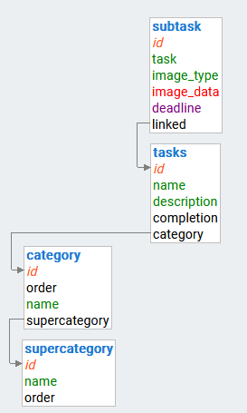
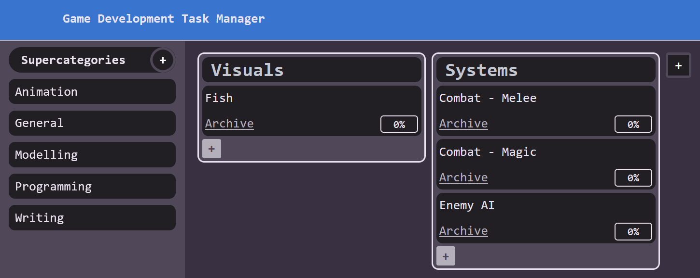
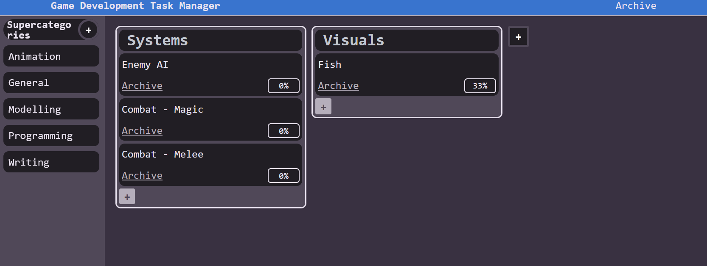
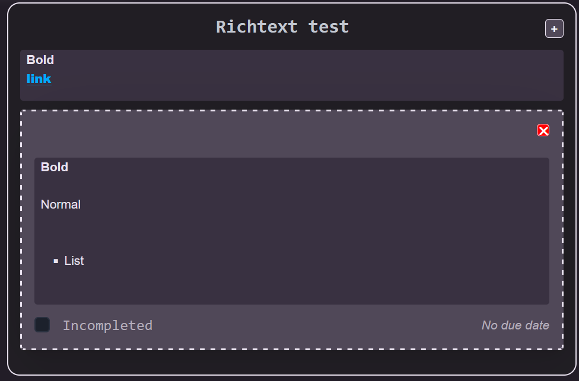

# Development of a Database-Linked Website for NCEA Level 2

Project Name: **Game Development Manager Website**

Project Author: **James Gerraty**

Assessment Standards: **91892** and **91893**

-------------------------------------------------

## Design, Development and Testing Log

### 16/05/24

Worked on a prototype for the database layout, where there are supercategories that store categories that store tasks that store subtasks.\
Both types of category hold a name and id.\
Tasks hold a name and description and a completion percentage
Subtasks hold a task name, optional image blob, and a deadline datetime.

### 21/05/24

Worked on a prototype for the site flowchart layout. I want the website to seem like it only has a single page, so we start on the general supercategory which displays all the categories and descendant tasks for that supercategory. Forms to create supercategories, categories, tasks, and subtasks will be done with iframes that display above the supercategory page. Delete and reorder requests will be handled by a page that redirects when done, or an invisible iframe that closes when done. This gives us a single page website.  
My current thinking is that supercategories will be displayed vertically on the left sidebar, categories will be displayed horizontally in the main portion of the page, and tasks will be displayed under the category. Clicking on a task will bring up an iframe which lists all the subtasks for a task.

### 30/05/24

I have made some changes to the database by adding the order keys to tasks as they need to be ordered within the task list for categories. Subtasks can be ordered by their id though I will ask my end users if they would really like to order subtasks as well. Also added a completed value to the table so that you can actually mark a subtask as done.

Have gotten my [wireframe](https://www.figma.com/proto/pfaXQRa3RBhN2Mvv3dRuT0/Game-Development-Manager---v0.0.1?node-id=1-2&t=Gp4fkgIBN0A21vR9-1&scaling=min-zoom&page-id=0%3A1&starting-point-node-id=1%3A2) into a state where I would like feedback on it before trying to get it too detailed, so I will show the prototype to my end users. I need to get some options for the colour theme that satisfies everyone's needs, especially for my end user with colour blindness.  
The subtask menu is still a work in progress.

**I had a conversation with two of my end users tonight after showing them the wireframe so far**  
### Feature suggestions:  
> Check list subtasks? - voxsinity  

> id maybe say one could have an embedded video but idk up to you - voxsinity

Videos are not something I want to add right now due to it being quite hard to store in a database  

> maybe you have an option to highlight more important things
> like words - voxsinity

I will try to support markdown or richtext for text fields  

> also do you need the ability to drag to reorder subtasks? - me  
> I do like the ability to reorder tasks  
> gives me more freedom  
> it would be very helpful - voxsinity  

> also do you want subtasks to be draggable to reorder them? - me  
> yessir - InconspicuousBotGuy

### Color palette suggestions:
> imo I'd do a uh  
> Blue of some sort - voxsinity (for the main accent color)  

> wait also what colors are hard to tell apart for you  
> i have to consider stuff like that - me    
> I'm mainly red green colorblind  
> but also i struggle with blue and purple  
> I can't see purple really except for some strict shades  
> idk what those shades are don't ask - voxsinity  

> so if i have just blue and some red there it shouldnt be confusing? - me  
> no  
> I'll be able to tell them apart  
> just as long as they aren't mangled together - voxsinity  

> i will probably replace the green with the blue for consistency - me  
> that would help - voxsinity  

> i find blue/orange accentuates these types of formats really well - InconspicuousBotGuy  

From this I have decided I will be using blue as a primary accent, replacing the green with said blue, and possibly using a more orange red and finding somewhere else to use orange as a secondary accent. I will also be updating the schema to include the order member to subtasks. I will not be adding videos. I will experiment with storing check list subtasks (maybe I can serialize it to store a variable number of checklist tasks within a subtask without further complicating the database)

### 10/06/24

I have decided on a [colour palette](https://www.realtimecolors.com/?colors=e9e2ef-393141-87bfe0-584d61-dc7856&fonts=Inter-Inter) using realtime colors. I will most likely be modifying the colours and taking alternative shades of the colours that fit better with my website.

I decided to scrap the orange accent for now as im not really sure where it fits, and I made the header a cornflower blue colour. The green was replaced by a light blue and I decided checkboxes should fill with the blue colour and have a white checkmark instead of have a green checkmark when enabled. This makes it easier to tell when a box is checked in my opinion.

I have bumped the version of my design to [v0.1.0](https://www.figma.com/design/HRjsMHtE3CrJ7whYkcAjqt/Game-Development-Manager---v0.1.0?node-id=0-1&t=mmCcCb4Uu9uTRTPN-1)  
see 12/06/24 for how to use the version history

### 12/06/24

When asking my team members about the colours:
> bring down font size of percentages just a hair so they can be easier to see? - InconspicuousBotGuy

I'm using the actual figma version history feature so if a previous version needs to be accessed, do so by opening the Game Development Manager file (not v0.0.1) and go to File/Show version history
I lowered the font size of the completion percentage on cards from 16 to 12 in v0.1.1, making it easier to read when its at '100%'

### 13/06/24

I have made some tweaks to the subtask page in v0.2.0  
The font for the content of the page has been changed from Fira Mono to Roboto, as I think its easier to read at this small size. The rest of the website still uses Fira Mono as I think it suits the website.  
The topbar of the subtask menu has been made more apparent with a dashed line and the scrollable container under it has been made apparent (also the content has been inset so that the scrollbar fits on the right)  
The delete buttons have been made less visible by removing the red background so that they don't draw as much attention and distract the user.  

In v0.2.1 I made the archive button under a card more apparent that is clickable without making it draw much more attention by underlining the text. This should hopefully communicate it is an action you can do to archive a card instead of "this card has been archived" which is not what it is showing.  
I also made some changes to the due date text in the subtask menu that should make it more visible. The font size has been increased by 2 and it uses the Condensed/Italic variant of Roboto so that it doesn't take up too much space. Completed cards will also strike-through the due date.  
  

In v0.3.0 I added little create buttons for tasks and categories as I realised i was missing them. I also made categories and tasks use a hover over delete button based on the new create button for that section of the page, instead of categories inheriting the delete button from the supercategory list. Also remembered to give tasks a delete button now.  
The alert and archive buttons were given a thin white stroke to make them pop out from the navbar.  

v1.0.0  
I am happy with the design of this right now, and have finished each part of the interface design after adding a placeholder add form.  
The form interface is built for adding subtasks however other create buttons link to it too, obviously the note wont make into the final product.  
I will ask my end users for feedback however these changes will affect the final product and likely wont be reflected in the wireframe. I will still include any comments made by them in the development log and document what I changed based on that.  

### 27/06/24

I have been working on the website for the past couple weeks.

So far I have it listing the supercategories fine, and am currently working on the js. Those white rectangles in the main section are test drag and drop elements, and work, though I am currently working on expanding the drag and drop functionality to be able to drag around all types of thing seperatly, so that you cannot drop a supercategory into a category or anything. I have also decided to load the categories and such I will be using AJAX queries to give the website a dynamic feel. This differs from my initial idea of using iframes for everything but does the same thing. A lot of the time has gone into trying to get things to look at least usable, and currently there are issues with the sidebar on different aspect ratios, but right now that isnt too much of a concern since this is targeted mainly at 16:9 with some support for laptop resolutions.

### 2/07/24

I have finished the type limits for the drag and drop functionality, so you can no longer drop a supercategory into a category or anything crazy like that. Im working on the form modals to create new supercategories, categories, tasks and subtasks.

Once I get the supercategory creation working, I will work on making the drag and drop update the database.

### 25/07/24

You can now create and remove supercategories.

The form to create a new supercategory has not been given proper styling yet and I will have to add that later. Removing a supercategory will bring up a broswer confirmation window to make sure you do not remove a supercategory on accident.

### 01/08/24

I have got the user interface and functionality close to a position where I can get more feedback from my users. There are still some major issues with reordering tasks bringing the category with them and causing both categories to become translucent 

Since last time I have done the category list and have mostly finished the task list. When categories overflow, they will overflow and the main frame will be scrollable. I realized this would be annoying to navigate with shift scrolling and so decided to make it so you can drag to scroll.

### 11/08/24

Got some feedback from one of my end users today (over voice call, so no actual quotes)

Voxsinity was happy with the current state of the website, though noted the Game Development Task Manager header was slightly closer to the top of the nav than the bottom, and asked me to fix it. Voxsinity was also alright with the task dragging and dropping requiring you to create a temporary task if you want to move one into a seperate category, though I will try to come up with a solution for this if I have time. He also told me to focus on making the forms and subtask menu look better, as I explained to him that I had not got around to styling it yet.

### 16/08/24

Over the past few days I have gotten the subtasks ironed out, and styled the forms and subtask menu (screenshots below). I decided I was not going to make the alert feature where you could ping people to subtasks, as it was underplanned and now there is not an easy way to implement it. I explained this to AwesomeProXXXX and he agreed that it would be easier to just yell at people in discord to look at a task when needed like we had already been doing. This feature would make more sense if there were accounts for this site, but that wasn't planned for, and alerts aren't really useful enough to redesign my site now.

Showed my users some screenshots of the current appearance of the form (specifically the subtask form, but they all look the same) and the subtask menu 

I was told by AwesomeProXXXX to make the delete button for subtasks red. He also expressed uncertainty about the datetime picker (specifically the hours and minutes selector) but that is designed by firefox and I can't really do anything about it, on chromium browsers there is a dedicated time picker but on firefox you have to manually input the time part of the datetime.

I made the button red 
> "Way better." - AwesomeProXXXX

I also finally got around to fixing the misaligned title.
  
The issue was being caused by the nav not taking up the full height of the header, so i set height to 100% and it fixed it.

I have taken steps to make sure that the html validates using the W3C markup validation service. My website initially had many errors relating to the use of multiple identifiers with the same name.   
I opened the subtask form on a task that had multiple subtasks loaded, so that I could validate most parts of my website at once. Most of these were pretty simple fixes.  
After this my website validated 

I also checked styles.css by pasting it in and there were two errors.   
The first one is one I missed that wasn't doing anything, and the second was a error with the font-optical-sizing property, which is a thing for variable fonts such as roboto condensed, I'm not really sure why it's not valid here as auto and none are valid values for it. It didn't really effect the look of the single thing roboto condensed is used for so I just got rid of the property and it fixed the issue. If you validate the css with all warnings on, there will be a ton since this relies on pico css for most of the heavy lifting.
After fixing those errors, my css validates on the normal report warning level. 

The website is pretty much finished now, though there may be some bugs I haven't found yet.

### 21/08/24 functionality testing
Stripping my database clean of the test data, I immediatley found a non critical problem. Deleting all of the supercategories will result in a giant error when opening the website.

As you can see, you can still create new supercategories here, so this isn't really a problem.

When creating a new category in this state, the server errors and nothing permanently bad happens.

I also noticed right away that the archived category in the archive supercategory is deleteable, which I know would for sure break the entire archive feature. I quickly implemented a server side check to make sure the id of the category being deleted is not 2, which is the id for the archived category. I did not implement a way of removing the delete button from the front end, as im pretty sure this would break other things and is really more effort than it's worth in my opinion.

The feature to stop people from creating new categories and tasks in the archive is working as intended.

Next, I inserted some example supercategories that we might use to organize our work.

These are in the order I inserted them as, but what if I decided that I actually want them to be ordered alphabetically. Well I can drag and drop them around in the list and end up with this. 
This order stayed after the page was refreshed, which tells me that the supercategory drag and drop functionality is working as expected.

I created some example categories and tasks in the programming section so I could test the reorder here.

I noticed that it had broken out of nowhere, and after a little digging realised that when I made the html valid, the header id on categories got changed to a class, and this was not updated in dnd.js, so it broke the whole thing. I quickly fixed this problem but I also realised that the last time I pulled from github on a school machine, some of the files weren't properly updated on the school server. I had to move to testing the website on the XAMPP server I have been using to work on this website at home. With that dealt with, lets say I dont like the order those two categories are in. I am able to click and drag the category over the other category to switch their positions, which now makes the systems category appear before the visuals category. 

This also saved upon refreshing.
Something that I did notice here was how buggy the task reorder was, especially when you mix moving the categories around in as well. This meant you constantly had to refresh the page to properly use this feautre, which isn't great. Some specific major problems with the task reorder I encountered was flat out not being able to reorder them at all after moving the category they were in, as it would try to drag the category instead of the task. There was also this issue where after dragging a category, then dragging a task within that category into another category would result in the other category retaining the ghost effect . Another thing that wasn't technically a bug was that it was very frustrating to move a task into another category, when you dont want to swap it with the one it lands on. This meant you had to create a new temporary task in the other category, and swap it with the one you want to move, then delete the temp one. This is obviously not great, but at this point all I can realistically do is be happy it even partially works.

Here I am testing the subtask image feature, with a GIF file. The file is 14kb, and the theoretical max for the database is 16mb. This is being tested on both the school server and my XAMPP server, as my XAMPP server has issues with large packets and its better to test this with the production environment. I'm unsure if the server functions were also not pushed to the school server, or the school server also doesn't like the larger packets, because after quite a while, it kicked me out of the subtask menu and didn't actually add the image. On my XAMPP server I ran into `General error: 2006 MySQL server has gone away`, and I don't really know how to mess with the mysql or php configs.

After trying the smaller 10kb jpeg fish, it successfully added it to the database and can load it on the website. While I still don't know for a fact if the full mediumblob could be used on the school server, I at least know that the image handling works. I know this isn't just an issue with GIF files, as I was able to save them before while implementing the image system, and after that while messing with the style sheets.

I added some more subtasks to demonstrate the dynamic styling depending on the size of the text and if there is an image, though, now I need to see if I can complete these subtasks, as the task tells me that it is 0% done.

As you can see, I marked one of these as done, and it came up with the blue completed border.

And the completion number has updated, telling me a third of the tasks are done.

While testing the delete button for supercategories, categories, tasks and subtasks, I found that all could be deleted, though it would load the subtask menu for the task you just deleted. This completely worked and the old subtasks would be displayed until you closed it as well. Sometimes this would generate an error  but once again it wasn't critical and you could just close the menu and pretend that never happened.

I tested the site at different aspect ratios as well, and found that its fine on most resolutions, though when the site becomes thin enough, the supercategory names will overflow into the rest of the website. This is unlikely to happen on any of the devices my users will be using. The only real problem with the interface that can happen is the supercategories label wrapping like it is there.

## 2/09/2024
Changes should have been pushed from the github to the school server now.

I implemented rudimentary support for rich text in task descriptions and subtasks.

You can write in any html in there and it will work, this could be exploited easily but I trust my end users.